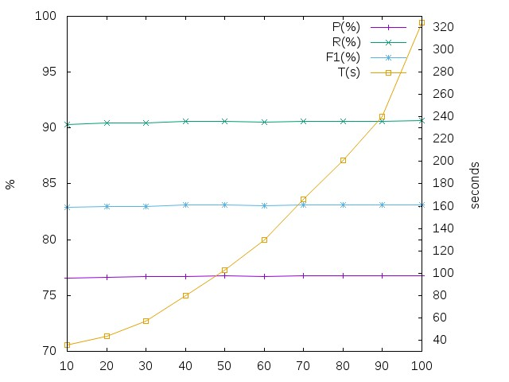

Baseline Detection Method
=========================

## Test
A set of 10 runs have been performed to figure out the effect of the number of
vertex of the original polygon (N) in the performance of the global baseline
detection.
All experiments are performed over a 30 pages dataset and M=4.

## Results

The effecto over the global performance is insignificant versus the computation 
time required. Then, default max number of vertex (`--max_vertex`) is set to 10.
